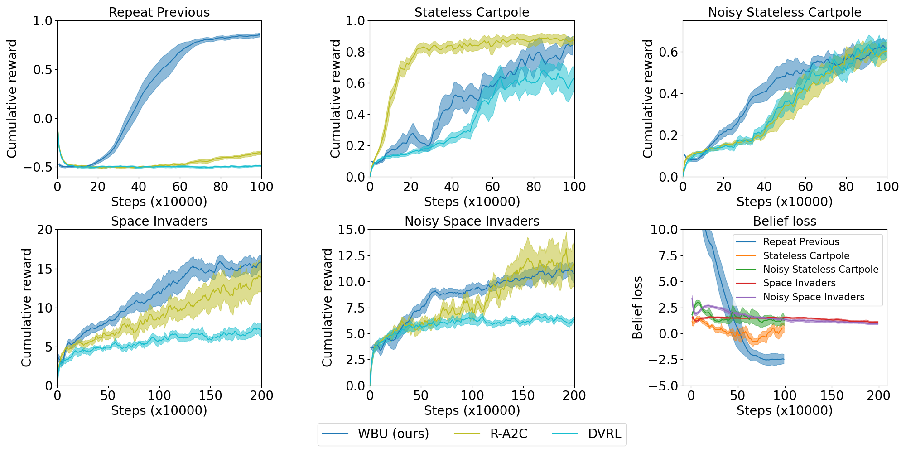

# The Wasserstein Believer
### Learning Belief Updates for Partially Observable Environments through Reliable Latent Space Models

ICLR 2024 paper: https://openreview.net/forum?id=KrtGfTGaGe

**Warning:** This code was tested on a linux environment with Python3.9


## Installation
```shell
python3.9 -m venv venv
source venv/bin/activate
pip install --no-deps -r requirements.txt
pip install --no-deps -e modules/popgym
pip install --no-deps -e modules/POMinAtar
pip install --no-deps -e modules/bwu
```

## Usage

### Repeat Previous

```shell
python run.py --config modules/bwu/belief_learner/config/repeat_previous.toml
```
### Stateless Cartpole

```shell
python run.py --config modules/bwu/belief_learner/config/stateless_cartpole.toml
```

### Noisy Stateless Cartpole

```shell
python run.py --config modules/bwu/belief_learner/config/noisy_stateless_cartpole.toml
```

### Space Invaders

```shell
python run.py --config modules/bwu/belief_learner/config/space_invaders.toml --timesteps 2e6
```

### Noisy Space Invaders

```shell
python run.py --config modules/bwu/belief_learner/config/noisy_space_invaders.toml --timesteps 2e6
```

## Results



## Cite
If you use this code, please cite it as:
```
@inproceedings{
avalosdelgrange2024wbu,
title={The Wasserstein Believer: Learning Belief Updates for Partially Observable Environments through Reliable Latent Space Models},
author={Rapha{\"e}l Avalos and Florent Delgrange and Ann Nowe and Guillermo Perez and Diederik M Roijers},
booktitle={The Twelfth International Conference on Learning Representations},
year={2024},
url={https://openreview.net/forum?id=KrtGfTGaGe}
}
```

## Acknowledgements

- MinAtar: https://github.com/kenjyoung/MinAtar
- PopGym: https://github.com/proroklab/popgym
